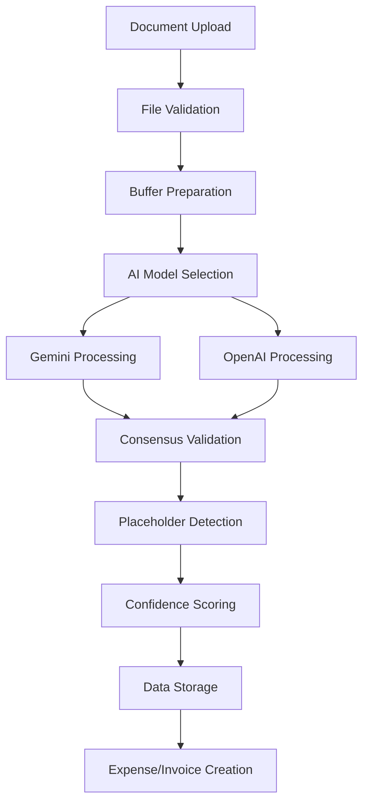

# AI Processing Pipeline Documentation - Contas-PT

*Last updated: July 1, 2025*

Complete documentation of the AI-powered document processing system with multi-model consensus and Portuguese optimization.

## Overview

The AI processing pipeline uses a sophisticated multi-model approach combining Google Gemini-2.5-Flash-Preview and OpenAI GPT-4o-Mini for maximum accuracy in Portuguese document extraction. The system implements real-time processing with WebSocket updates and comprehensive validation against placeholder data.

## Architecture

### Processing Strategy

**Primary Engine**: Google Gemini-2.5-Flash-Preview
- Enhanced vision capabilities for direct document analysis
- Optimized for Portuguese business documents
- Structured JSON output with high confidence scores
- Real-time processing with WebSocket status updates

**Secondary Engine**: OpenAI GPT-4o-Mini
- Fallback processing and validation
- Cross-validation of Gemini results
- Enhanced accuracy through multi-model consensus
- Specialized Portuguese prompt engineering

**Quality Assurance**: Placeholder Detection System
- Validates against generic fallback data
- Ensures only authentic extracted information
- Multilingual placeholder pattern recognition
- Confidence scoring based on actual data quality

## Core Components

### Cloud Document Processor (`server/agents/CloudDocumentProcessor.ts`)

Main orchestrator for AI processing with cloud-first strategy:

```typescript
export class CloudDocumentProcessor {
  private openAIExtractor: AgentExtractorOpenAI | null = null;
  private geminiExtractor: AgentExtractorGemini | null = null;
  private enhancedProcessor: EnhancedCloudProcessor | null = null;

  async processDocument(
    buffer: Buffer, 
    mimeType: string, 
    tenantId: number
  ): Promise<ExtractionResult> {
    // Multi-model processing with consensus validation
    // Real-time status updates via WebSocket
    // Portuguese document optimization
  }
}
```

**Features:**
- Automatic model selection based on document type
- Multi-model consensus for maximum accuracy
- Real-time processing status via WebSocket
- Comprehensive error handling and recovery
- Portuguese business document specialization

### Gemini Extractor (`server/agents/AgentExtractorGemini.ts`)

Primary AI processor using Google's latest vision model:

```typescript
export class AgentExtractorGemini {
  constructor(private apiKey: string) {
    this.genAI = new GoogleGenerativeAI(apiKey);
    this.model = this.genAI.getGenerativeModel({ 
      model: "gemini-2.5-flash-preview-05-20" 
    });
  }

  async extractFromDocument(
    buffer: Buffer, 
    mimeType: string
  ): Promise<ExtractionResult> {
    // Vision-based document analysis
    // Structured JSON output
    // Portuguese prompt optimization
  }
}
```

**Capabilities:**
- Direct PDF and image processing without OCR preprocessing
- Portuguese business document pattern recognition
- Structured output with comprehensive field extraction
- High confidence scoring for data quality assessment
- Enhanced vision processing for complex layouts

### OpenAI Extractor (`server/agents/AgentExtractorOpenAI.ts`)

Secondary processor for validation and fallback:

```typescript
export class AgentExtractorOpenAI {
  constructor(private apiKey: string) {
    this.openai = new OpenAI({ apiKey });
  }

  async extractFromDocument(
    buffer: Buffer, 
    mimeType: string
  ): Promise<ExtractionResult> {
    // GPT-4o-Mini processing
    // Cross-validation capabilities
    // Portuguese context understanding
  }
}
```

**Features:**
- GPT-4o-Mini model for enhanced accuracy
- Portuguese business context understanding
- Cross-validation of Gemini results
- Fallback processing when primary model fails
- Specialized prompts for Portuguese invoices and receipts

### Enhanced Cloud Processor (`server/agents/EnhancedCloudProcessor.ts`)

Multi-model consensus engine for maximum accuracy:

```typescript
export class EnhancedCloudProcessor {
  constructor(
    private openAIKey: string, 
    private geminiKey: string
  ) {
    // Initialize both extractors
    // Configure consensus validation
  }

  async processWithConsensus(
    buffer: Buffer, 
    mimeType: string
  ): Promise<ExtractionResult> {
    // Run both models in parallel
    // Compare and validate results
    // Generate consensus extraction
    // Apply placeholder detection
  }
}
```

**Consensus Algorithm:**
1. Process document with both AI models simultaneously
2. Compare extracted fields for consistency
3. Validate against placeholder patterns
4. Generate confidence scores based on agreement
5. Select best results or flag for manual review

## Processing Workflow

### Document Upload Flow



### Real-time Status Updates

WebSocket integration provides live processing updates:

```typescript
// Client-side WebSocket connection
const ws = new WebSocket('ws://localhost:5000');
ws.onmessage = (event) => {
  const update = JSON.parse(event.data);
  if (update.type === 'processing_status') {
    updateProcessingUI(update.documentId, update.status);
  }
};

// Server-side status broadcasting
this.broadcastProcessingUpdate(documentId, {
  status: 'processing',
  model: 'gemini-2.5-flash-preview',
  progress: 45
});
```

### Error Handling and Recovery

Comprehensive error handling ensures processing reliability:

```typescript
async processWithFallback(buffer: Buffer, mimeType: string) {
  try {
    // Try primary Gemini processor
    return await this.geminiExtractor.extract(buffer, mimeType);
  } catch (geminiError) {
    console.log('Gemini processing failed, using OpenAI fallback');
    try {
      return await this.openAIExtractor.extract(buffer, mimeType);
    } catch (openAIError) {
      // Manual review required
      return this.createManualReviewResult(geminiError, openAIError);
    }
  }
}
```

## Portuguese Document Optimization

### Specialized Prompts

The system uses Portuguese-optimized prompts for maximum accuracy:

```typescript
const portugueseInvoicePrompt = `
Analise esta fatura portuguesa e extraia os seguintes dados:
- Nome do fornecedor (vendor)
- NIF (número de identificação fiscal) 
- Montante total (com símbolo €)
- Taxa de IVA (6%, 13%, ou 23%)
- Data da fatura (formato DD/MM/YYYY)
- Número da fatura
- Morada completa do emissor

IMPORTANTE: 
- NÃO use valores genéricos como "Fornecedor Desconhecido"
- SÓ extraia dados que estejam claramente visíveis no documento
- Deixe campos vazios se a informação não estiver disponível
- Valide o formato do NIF português (9 dígitos)
`;
```

### Portuguese Business Patterns

Recognition patterns for Portuguese business documents:

- **NIF Validation**: 9-digit Portuguese tax ID format with algorithm verification
- **VAT Rates**: Automatic recognition of 6%, 13%, 23% rates with regional variations
- **Currency Format**: EUR symbol placement and decimal separator recognition
- **Date Formats**: DD/MM/YYYY and European date pattern recognition
- **Address Patterns**: Portuguese postal code and address format recognition

### Field Mapping

Standardized field extraction for Portuguese invoices:

```typescript
interface PortugueseInvoiceData {
  vendor: string;              // Nome do fornecedor
  vendorNIF: string;          // NIF do fornecedor (PT + 9 digits)
  vendorAddress: string;       // Morada completa
  invoiceNumber: string;       // Número da fatura
  invoiceDate: string;        // Data da fatura (DD/MM/YYYY)
  subtotal: number;           // Valor sem IVA
  vatAmount: number;          // Montante do IVA
  vatRate: number;            // Taxa de IVA (6, 13, ou 23)
  totalAmount: number;        // Total com IVA
  currency: 'EUR';            // Sempre EUR para Portugal
  paymentTerms?: string;      // Condições de pagamento
  dueDate?: string;          // Data de vencimento
}
```

## Quality Assurance

### Placeholder Detection

Advanced validation prevents generic fallback data:

```typescript
const validateField = (value: string, fieldType: string): boolean => {
  const placeholderPatterns = [
    /unknown\s*(vendor|company|supplier)/i,
    /not\s*(provided|available|found)/i,
    /generic\s*(company|business)/i,
    /fornecedor\s*desconhecido/i,
    /não\s*disponível/i,
    /[0-9]{3}\.?[0-9]{3}\.?[0-9]{3}/  // Generic NIF patterns
  ];
  
  return !placeholderPatterns.some(pattern => pattern.test(value));
};
```

### Confidence Scoring

Multi-model confidence calculation:

```typescript
const calculateConsensusConfidence = (
  geminiResult: ExtractionResult,
  openAIResult: ExtractionResult
): number => {
  const fieldAgreement = compareExtractedFields(geminiResult, openAIResult);
  const placeholderScore = validateAgainstPlaceholders(geminiResult);
  const dataQuality = assessDataCompleteness(geminiResult);
  
  return (fieldAgreement * 0.4) + (placeholderScore * 0.3) + (dataQuality * 0.3);
};
```

### Data Validation

Comprehensive validation for Portuguese business data:

```typescript
const validatePortugueseInvoice = (data: PortugueseInvoiceData): ValidationResult => {
  return {
    nifValid: validatePortugueseNIF(data.vendorNIF),
    vatRateValid: [6, 13, 23].includes(data.vatRate),
    dateValid: isValidPortugueseDate(data.invoiceDate),
    amountValid: data.totalAmount > 0 && data.subtotal > 0,
    currencyValid: data.currency === 'EUR'
  };
};
```

## Performance Optimization

### Parallel Processing

Both AI models process documents simultaneously for faster results:

```typescript
const processInParallel = async (buffer: Buffer, mimeType: string) => {
  const [geminiResult, openAIResult] = await Promise.allSettled([
    this.geminiExtractor.extract(buffer, mimeType),
    this.openAIExtractor.extract(buffer, mimeType)
  ]);
  
  return this.generateConsensus(geminiResult, openAIResult);
};
```

### Caching Strategy

Intelligent caching reduces processing costs:

```typescript
const cacheKey = `doc_${documentHash}_${modelVersion}`;
const cachedResult = await this.cache.get(cacheKey);

if (cachedResult && this.isCacheValid(cachedResult)) {
  return cachedResult;
}

const freshResult = await this.processDocument(buffer, mimeType);
await this.cache.set(cacheKey, freshResult, CACHE_TTL);
```

### Resource Management

Efficient resource utilization for cloud AI APIs:

- Rate limiting to prevent API quota exhaustion
- Request queuing for high-volume processing
- Automatic retry with exponential backoff
- Cost optimization through model selection
- Processing prioritization based on document importance

## Integration Points

### Database Storage

Processed results are stored in multiple tables:

- `documents`: Processing status and metadata
- `extracted_invoice_data`: Structured extraction results
- `multi_agent_results`: Consensus validation results
- `expenses`/`invoices`: Created business records

### Cloud Storage Integration

Seamless integration with Dropbox and Google Drive:

```typescript
// Dropbox scheduler integration
export class DropboxScheduler {
  async processDropboxFile(file: DropboxFile, config: CloudDriveConfig) {
    const buffer = await this.downloadFile(file.path);
    const result = await this.cloudProcessor.processDocument(
      buffer, 
      file.mimeType, 
      config.tenantId
    );
    
    await this.createExpenseFromExtraction(result, config.tenantId);
  }
}
```

### WebSocket Updates

Real-time processing status for improved user experience:

```typescript
// Broadcasting processing updates
this.io.to(`tenant_${tenantId}`).emit('processing_update', {
  documentId,
  status: 'completed',
  extractedData: result,
  confidence: result.confidence,
  processingTime: Date.now() - startTime
});
```

## Error Handling

### Processing Failures

Comprehensive error handling and recovery:

```typescript
try {
  const result = await this.processDocument(buffer, mimeType, tenantId);
  return result;
} catch (error) {
  console.error('AI processing failed:', error);
  
  // Store error for debugging
  await this.storeProcessingError(documentId, error);
  
  // Flag for manual review
  await this.flagForManualReview(documentId, error.message);
  
  // Return partial results if available
  return this.createPartialResult(documentId, error);
}
```

### Rate Limiting

API rate limit handling for cloud services:

```typescript
const withRateLimit = async (apiCall: () => Promise<any>) => {
  try {
    return await apiCall();
  } catch (error) {
    if (error.status === 429) {
      const delay = this.calculateBackoffDelay();
      await this.wait(delay);
      return await apiCall(); // Retry after delay
    }
    throw error;
  }
};
```

This documentation provides complete coverage of the AI processing pipeline as implemented in Contas-PT as of June 23, 2025, including all recent enhancements and optimizations.